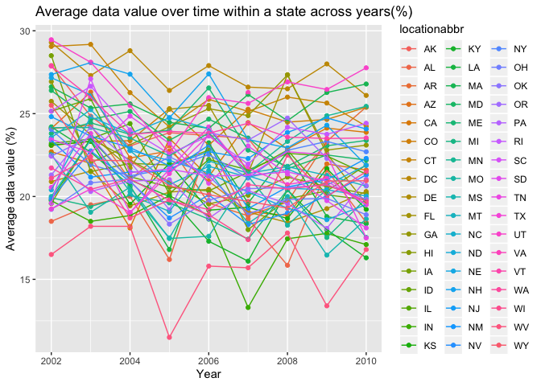

p8105\_hw3\_ra2965
================

Problem 1
=========

``` r
devtools::install_github("p8105/p8105.datasets")
library(p8105.datasets)
data(instacart)
```

Instacart is an online grocery service that allows people to shop online from local stores. This dataset describes the details of the online orders at Instacart. The dataset instacart contains 1384617 rows and 15 variables, where each row in the dataset is a product from an order. There is a single order per user in this dataset.

There are 15 variables in this dataset including the identifiers for the products, orders and customers, for example:

add\_to\_cart\_order: order in which each product was added to cart

reordered: indicator of whether this prodcut has been ordered by this user in the past

eval\_set: which evaluation set this order belongs in

order\_number: the order sequence number for this user

order\_dow: the day of the week on which the order was placed

order\_hour\_of\_day: the hour of the day on which the order was placed

days\_since\_prior\_order: days since the last order, capped at 30, product\_name: name of the product

aisle: the name of the aisle

department: the name of the department

giving illstrative examples of observations:
--------------------------------------------

Take the first observation as an example: It records the product 49302, which is Bulgarian Yogurt, in the first order recorded of the user 112108. It belongs in the evaluation set of train. The order sequence number for this user is 4. The order was placed in the 10th hour in the day and it is the 4th day of the week. There are 9 days since the last order. The aisle id is 120 and the name of the aisle is yogurt.The product is in the department of dairy eggs.

``` r
library(tidyverse)
```

    ## ── Attaching packages ─────────────────────────── tidyverse 1.2.1 ──

    ## ✔ ggplot2 3.2.1     ✔ purrr   0.3.2
    ## ✔ tibble  2.1.3     ✔ dplyr   0.8.3
    ## ✔ tidyr   1.0.0     ✔ stringr 1.4.0
    ## ✔ readr   1.3.1     ✔ forcats 0.4.0

    ## ── Conflicts ────────────────────────────── tidyverse_conflicts() ──
    ## ✖ dplyr::filter() masks stats::filter()
    ## ✖ dplyr::lag()    masks stats::lag()

``` r
instacart %>% group_by(aisle) %>% 
  summarize(n = n()) %>% 
  arrange(desc(n))
```

    ## # A tibble: 134 x 2
    ##    aisle                              n
    ##    <chr>                          <int>
    ##  1 fresh vegetables              150609
    ##  2 fresh fruits                  150473
    ##  3 packaged vegetables fruits     78493
    ##  4 yogurt                         55240
    ##  5 packaged cheese                41699
    ##  6 water seltzer sparkling water  36617
    ##  7 milk                           32644
    ##  8 chips pretzels                 31269
    ##  9 soy lactosefree                26240
    ## 10 bread                          23635
    ## # … with 124 more rows

Answer the questions:
---------------------

There are 134 aisles, and the most items ordered from is fresh vegetables.

``` r
library(ggridges)
```

    ## 
    ## Attaching package: 'ggridges'

    ## The following object is masked from 'package:ggplot2':
    ## 
    ##     scale_discrete_manual

``` r
order_df = instacart %>% 
  group_by(aisle) %>% 
  summarize(n = n()) %>% 
  filter(n > 10000) %>% 
  mutate(aisle = as.factor(aisle), 
         aisle = forcats::fct_reorder(aisle, n))
    
  ggplot(order_df,aes(x = aisle, y = n)) + 
    geom_point(alpha = 0.6) +
    labs(
    title = "The number of items ordered in each aisle",
    x = "aisle",
    y = "number of items") +
    scale_y_continuous(
    breaks  = c(20000, 40000,  60000,  80000,  100000, 120000, 140000, 160000), 
    limits = c(9000, 160000)
    ) + theme(axis.text.x = element_text(angle = 60, hjust = 1))
```


``` r
popular_product = instacart %>% filter(aisle == "baking ingredients"|aisle == "dog food care"|aisle == "packaged vegetables fruits") %>% 
  group_by(aisle, product_name) %>%
  summarize(n_pop_pro = n()) %>%
  filter(min_rank(desc(n_pop_pro)) < 4) 
  knitr::kable(popular_product,digits = 1)
```

| aisle                      | product\_name                                 |  n\_pop\_pro|
|:---------------------------|:----------------------------------------------|------------:|
| baking ingredients         | Cane Sugar                                    |          336|
| baking ingredients         | Light Brown Sugar                             |          499|
| baking ingredients         | Pure Baking Soda                              |          387|
| dog food care              | Organix Chicken & Brown Rice Recipe           |           28|
| dog food care              | Small Dog Biscuits                            |           26|
| dog food care              | Snack Sticks Chicken & Rice Recipe Dog Treats |           30|
| packaged vegetables fruits | Organic Baby Spinach                          |         9784|
| packaged vegetables fruits | Organic Blueberries                           |         4966|
| packaged vegetables fruits | Organic Raspberries                           |         5546|

``` r
#what should be in the table? product name or number
mean_hour = instacart %>% 
  filter(product_name == "Pink Lady Apples"|product_name == "Coffee Ice Cream") %>% 
  group_by(product_name, order_dow) %>%
  summarize(mean_hour_of_day = mean(order_hour_of_day)) %>%
  select(product_name, order_dow,mean_hour_of_day) %>%
  pivot_wider(
    names_from = "order_dow",
    values_from = "mean_hour_of_day"
  )
knitr::kable(mean_hour,digits = 3)
```

| product\_name    |       0|       1|       2|       3|       4|       5|       6|
|:-----------------|-------:|-------:|-------:|-------:|-------:|-------:|-------:|
| Coffee Ice Cream |  13.774|  14.316|  15.381|  15.318|  15.217|  12.263|  13.833|
| Pink Lady Apples |  13.441|  11.360|  11.702|  14.250|  11.552|  12.784|  11.938|

``` r
# how to show the table after knit?
```

Problem 2
=========

``` r
library(p8105.datasets)
data(brfss_smart2010) 

health = brfss_smart2010 %>%
  janitor::clean_names() %>%
  filter(topic == "Overall Health") %>%
  filter(response %in% c("Excellent","Very good", "Good", "Fair","Poor") )%>%
  mutate(response = forcats::fct_relevel(response, c("Poor", "Fair", "Good","Very good","Excellent"))) 
```

``` r
num_loc_2002 = health %>% filter(year == 2002) %>%
  group_by(locationabbr, locationdesc) %>% 
  summarise(n = n()) %>% 
  group_by(locationabbr) %>% 
  summarise(obs_loc_num = n()) %>%
  filter(obs_loc_num >= 7)
knitr::kable(num_loc_2002,digits = 3)
```

| locationabbr |  obs\_loc\_num|
|:-------------|--------------:|
| CT           |              7|
| FL           |              7|
| MA           |              8|
| NC           |              7|
| NJ           |              8|
| PA           |             10|

``` r
num_loc_2010 = health %>% filter(year == 2010) %>%
  group_by(locationabbr, locationdesc) %>% 
  summarise(n = n()) %>% 
  group_by(locationabbr) %>% 
  summarise(obs_loc_num = n()) %>%
  filter(obs_loc_num >= 7) 
knitr::kable(num_loc_2010,digits = 3)
```

| locationabbr |  obs\_loc\_num|
|:-------------|--------------:|
| CA           |             12|
| CO           |              7|
| FL           |             41|
| MA           |              9|
| MD           |             12|
| NC           |             12|
| NE           |             10|
| NJ           |             19|
| NY           |              9|
| OH           |              8|
| PA           |              7|
| SC           |              7|
| TX           |             16|
| WA           |             10|

``` r
#what actually is asking?     
```

``` r
excellent_response = health %>% 
  filter(response == "Excellent") %>%
  group_by(locationabbr,year) %>%
  summarize(mean_data = mean(data_value,na.rm = TRUE)) 
#how to round the mean data? do we have to?

excellent_response %>%
  ggplot(aes(x = year, y = mean_data, color = locationabbr)) + 
  geom_line() +
  labs(
    title = "Average data value over time within a state across years(%)",
    x = "Year",
    y = "Average data value (%)"
  ) 
```



``` r
#do we need to make the plot clearly? how can we make it look nice?
```

``` r
ny = health %>% 
  filter(locationabbr == "NY", year %in% c(2006,2010)) 
ggplot(ny, aes(x = response, y = data_value)) + 
  geom_boxplot() +
   facet_grid(~year) + 
  viridis::scale_fill_viridis(discrete = TRUE) +
  theme(axis.text.x = element_text(angle = 45, hjust = 1)) +
  labs(
    title = "Distribution of data_value for responses among locations in NY State",
    x = "Response",
    y = "Data Value (%)"
  ) 
```


``` r
#Warning in install.packages :package ‘patchwork’ is not available (for R version 3.6.1)
```

``` r
accel_data = read_csv(file = "./accel_data.csv")
```
