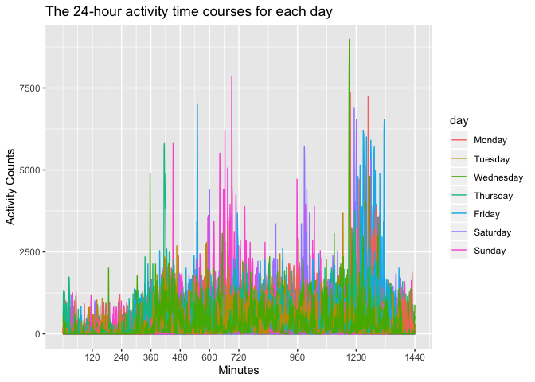

p8105\_hw3\_ra2965
================

Problem 1
=========

``` r
#devtools::install_github("p8105/p8105.datasets")
library(p8105.datasets)
data(instacart)
```

Instacart is an online grocery service that allows people to shop online from local stores. This dataset describes the details of the online orders at Instacart. The dataset instacart contains 1384617 rows and 15 variables, where each row in the dataset is a product from an order. There is a single order per user in this dataset.

There are 15 variables in this dataset including the identifiers for the products, orders and customers, for example:

add\_to\_cart\_order: order in which each product was added to cart

reordered: indicator of whether this prodcut has been ordered by this user in the past

eval\_set: which evaluation set this order belongs in

order\_number: the order sequence number for this user

order\_dow: the day of the week on which the order was placed

order\_hour\_of\_day: the hour of the day on which the order was placed

days\_since\_prior\_order: days since the last order, capped at 30, product\_name: name of the product

aisle: the name of the aisle

department: the name of the department

giving illstrative examples of observations:
--------------------------------------------

Take the first observation as an example: It records the product 49302, which is Bulgarian Yogurt, in the first order recorded of the user 112108. It belongs in the evaluation set of train. The order sequence number for this user is 4. The order was placed in the 10th hour in the day and it is the 4th day of the week. There were 9 days since the last order. The aisle ID is 120 and the name of the aisle is yogurt.The product is in the department of dairy eggs.

``` r
library(tidyverse)
```

    ## ── Attaching packages ─────────────────────────── tidyverse 1.2.1 ──

    ## ✔ ggplot2 3.2.1     ✔ purrr   0.3.2
    ## ✔ tibble  2.1.3     ✔ dplyr   0.8.3
    ## ✔ tidyr   1.0.0     ✔ stringr 1.4.0
    ## ✔ readr   1.3.1     ✔ forcats 0.4.0

    ## ── Conflicts ────────────────────────────── tidyverse_conflicts() ──
    ## ✖ dplyr::filter() masks stats::filter()
    ## ✖ dplyr::lag()    masks stats::lag()

``` r
instacart %>% 
  group_by(aisle) %>% 
  summarize(n = n()) %>% 
  arrange(desc(n))
```

    ## # A tibble: 134 x 2
    ##    aisle                              n
    ##    <chr>                          <int>
    ##  1 fresh vegetables              150609
    ##  2 fresh fruits                  150473
    ##  3 packaged vegetables fruits     78493
    ##  4 yogurt                         55240
    ##  5 packaged cheese                41699
    ##  6 water seltzer sparkling water  36617
    ##  7 milk                           32644
    ##  8 chips pretzels                 31269
    ##  9 soy lactosefree                26240
    ## 10 bread                          23635
    ## # … with 124 more rows

There are 134 aisles, and the most items ordered from is "fresh vegetables".

``` r
library(ggridges)

order_df = instacart %>% 
  group_by(aisle) %>% 
  summarize(n = n()) %>% 
  filter(n > 10000) %>% 
  mutate(aisle = as.factor(aisle), 
         aisle = forcats::fct_reorder(aisle, n))
    
  ggplot(order_df,aes(x = aisle, y = n)) + 
    geom_point(alpha = 0.6) +
    labs(
    title = "The number of items ordered in each aisle",
    x = "aisle",
    y = "number of items") +
    scale_y_continuous(
    breaks  = c(20000, 40000,  60000,  80000,  100000, 120000, 140000, 160000), 
    limits = c(9000, 160000)
    ) + theme(axis.text.x = element_text(angle = 60, hjust = 1))
```


``` r
popular_product = instacart %>% 
  filter(aisle == "baking ingredients"|aisle == "dog food care"|aisle == "packaged vegetables fruits") %>% 
  group_by(aisle, product_name) %>%
  summarize(n_pop_pro = n()) %>%
  filter(min_rank(desc(n_pop_pro)) < 4) 
  knitr::kable(popular_product %>%
               arrange(desc(n_pop_pro)),
               col.names = c("Aisle", "Most Popular Items", "Number of Items"),
               format = "html",
               caption = "The 3 most popular items in each of the 3 aisles"
               )
```

<table>
<caption>
The 3 most popular items in each of the 3 aisles
</caption>
<thead>
<tr>
<th style="text-align:left;">
Aisle
</th>
<th style="text-align:left;">
Most Popular Items
</th>
<th style="text-align:right;">
Number of Items
</th>
</tr>
</thead>
<tbody>
<tr>
<td style="text-align:left;">
packaged vegetables fruits
</td>
<td style="text-align:left;">
Organic Baby Spinach
</td>
<td style="text-align:right;">
9784
</td>
</tr>
<tr>
<td style="text-align:left;">
packaged vegetables fruits
</td>
<td style="text-align:left;">
Organic Raspberries
</td>
<td style="text-align:right;">
5546
</td>
</tr>
<tr>
<td style="text-align:left;">
packaged vegetables fruits
</td>
<td style="text-align:left;">
Organic Blueberries
</td>
<td style="text-align:right;">
4966
</td>
</tr>
<tr>
<td style="text-align:left;">
baking ingredients
</td>
<td style="text-align:left;">
Light Brown Sugar
</td>
<td style="text-align:right;">
499
</td>
</tr>
<tr>
<td style="text-align:left;">
baking ingredients
</td>
<td style="text-align:left;">
Pure Baking Soda
</td>
<td style="text-align:right;">
387
</td>
</tr>
<tr>
<td style="text-align:left;">
baking ingredients
</td>
<td style="text-align:left;">
Cane Sugar
</td>
<td style="text-align:right;">
336
</td>
</tr>
<tr>
<td style="text-align:left;">
dog food care
</td>
<td style="text-align:left;">
Snack Sticks Chicken & Rice Recipe Dog Treats
</td>
<td style="text-align:right;">
30
</td>
</tr>
<tr>
<td style="text-align:left;">
dog food care
</td>
<td style="text-align:left;">
Organix Chicken & Brown Rice Recipe
</td>
<td style="text-align:right;">
28
</td>
</tr>
<tr>
<td style="text-align:left;">
dog food care
</td>
<td style="text-align:left;">
Small Dog Biscuits
</td>
<td style="text-align:right;">
26
</td>
</tr>
</tbody>
</table>
``` r
mean_hour = instacart %>% 
  filter(product_name == "Pink Lady Apples"|product_name == "Coffee Ice Cream") %>% 
  group_by(product_name, order_dow) %>%
  summarize(mean_hour_of_day = mean(order_hour_of_day)) %>%
  select(product_name, order_dow,mean_hour_of_day) %>%
  pivot_wider(
    names_from = "order_dow",
    values_from = "mean_hour_of_day"
  )
knitr::kable(mean_hour, 
             format = "html",
             caption = "The mean hour of the day at which Pink Lady Apples and Coffee Ice Cream are ordered on each day of the week",
             col.names = c("Product Name", "Sunday", "Monday","Tuesday","Wednesday","Thursday","Friday","Saturday"),
             digits = 3)
```

<table>
<caption>
The mean hour of the day at which Pink Lady Apples and Coffee Ice Cream are ordered on each day of the week
</caption>
<thead>
<tr>
<th style="text-align:left;">
Product Name
</th>
<th style="text-align:right;">
Sunday
</th>
<th style="text-align:right;">
Monday
</th>
<th style="text-align:right;">
Tuesday
</th>
<th style="text-align:right;">
Wednesday
</th>
<th style="text-align:right;">
Thursday
</th>
<th style="text-align:right;">
Friday
</th>
<th style="text-align:right;">
Saturday
</th>
</tr>
</thead>
<tbody>
<tr>
<td style="text-align:left;">
Coffee Ice Cream
</td>
<td style="text-align:right;">
13.774
</td>
<td style="text-align:right;">
14.316
</td>
<td style="text-align:right;">
15.381
</td>
<td style="text-align:right;">
15.318
</td>
<td style="text-align:right;">
15.217
</td>
<td style="text-align:right;">
12.263
</td>
<td style="text-align:right;">
13.833
</td>
</tr>
<tr>
<td style="text-align:left;">
Pink Lady Apples
</td>
<td style="text-align:right;">
13.441
</td>
<td style="text-align:right;">
11.360
</td>
<td style="text-align:right;">
11.702
</td>
<td style="text-align:right;">
14.250
</td>
<td style="text-align:right;">
11.552
</td>
<td style="text-align:right;">
12.784
</td>
<td style="text-align:right;">
11.938
</td>
</tr>
</tbody>
</table>
Problem 2
=========

Import dataset and tidy it:
---------------------------

``` r
library(p8105.datasets)
data(brfss_smart2010) 

health = brfss_smart2010 %>%
  janitor::clean_names() %>%
  filter(topic == "Overall Health") %>%
  filter(response %in% c("Excellent","Very good", "Good", "Fair","Poor") ) %>%
  mutate(response = forcats::fct_relevel(response, c("Poor", "Fair", "Good","Very good","Excellent"))) 
```

In 2002, which states were observed at 7 or more locations?
-----------------------------------------------------------

``` r
num_loc_2002 = health %>% 
  filter(year == 2002) %>%
  group_by(locationabbr, locationdesc) %>% 
  summarise(n = n()) %>% 
  group_by(locationabbr) %>% 
  summarise(obs_loc_num = n()) %>%
  filter(obs_loc_num >= 7)
knitr::kable(num_loc_2002,
             col.names = c("State Abbreviation", "Number of observed Locations"),
             format = "html",
             caption = "The states that were observed at 7 or more locations in 2002"
             )
```

<table>
<caption>
The states that were observed at 7 or more locations in 2002
</caption>
<thead>
<tr>
<th style="text-align:left;">
State Abbreviation
</th>
<th style="text-align:right;">
Number of observed Locations
</th>
</tr>
</thead>
<tbody>
<tr>
<td style="text-align:left;">
CT
</td>
<td style="text-align:right;">
7
</td>
</tr>
<tr>
<td style="text-align:left;">
FL
</td>
<td style="text-align:right;">
7
</td>
</tr>
<tr>
<td style="text-align:left;">
MA
</td>
<td style="text-align:right;">
8
</td>
</tr>
<tr>
<td style="text-align:left;">
NC
</td>
<td style="text-align:right;">
7
</td>
</tr>
<tr>
<td style="text-align:left;">
NJ
</td>
<td style="text-align:right;">
8
</td>
</tr>
<tr>
<td style="text-align:left;">
PA
</td>
<td style="text-align:right;">
10
</td>
</tr>
</tbody>
</table>
In 2002,the abbreviation of states which were observed at 7 or more locations are shown in the table above.

In 2010, which states were observed at 7 or more locations?
-----------------------------------------------------------

``` r
num_loc_2010 = health %>% filter(year == 2010) %>%
  group_by(locationabbr, locationdesc) %>% 
  summarise(n = n()) %>% 
  group_by(locationabbr) %>% 
  summarise(obs_loc_num = n()) %>%
  filter(obs_loc_num >= 7) 
knitr::kable(num_loc_2010,
             col.names = c("State Abbreviation", "Number of observed Locations"),
             format = "html",
             caption = "The states that were observed at 7 or more locations in 2010")
```

<table>
<caption>
The states that were observed at 7 or more locations in 2010
</caption>
<thead>
<tr>
<th style="text-align:left;">
State Abbreviation
</th>
<th style="text-align:right;">
Number of observed Locations
</th>
</tr>
</thead>
<tbody>
<tr>
<td style="text-align:left;">
CA
</td>
<td style="text-align:right;">
12
</td>
</tr>
<tr>
<td style="text-align:left;">
CO
</td>
<td style="text-align:right;">
7
</td>
</tr>
<tr>
<td style="text-align:left;">
FL
</td>
<td style="text-align:right;">
41
</td>
</tr>
<tr>
<td style="text-align:left;">
MA
</td>
<td style="text-align:right;">
9
</td>
</tr>
<tr>
<td style="text-align:left;">
MD
</td>
<td style="text-align:right;">
12
</td>
</tr>
<tr>
<td style="text-align:left;">
NC
</td>
<td style="text-align:right;">
12
</td>
</tr>
<tr>
<td style="text-align:left;">
NE
</td>
<td style="text-align:right;">
10
</td>
</tr>
<tr>
<td style="text-align:left;">
NJ
</td>
<td style="text-align:right;">
19
</td>
</tr>
<tr>
<td style="text-align:left;">
NY
</td>
<td style="text-align:right;">
9
</td>
</tr>
<tr>
<td style="text-align:left;">
OH
</td>
<td style="text-align:right;">
8
</td>
</tr>
<tr>
<td style="text-align:left;">
PA
</td>
<td style="text-align:right;">
7
</td>
</tr>
<tr>
<td style="text-align:left;">
SC
</td>
<td style="text-align:right;">
7
</td>
</tr>
<tr>
<td style="text-align:left;">
TX
</td>
<td style="text-align:right;">
16
</td>
</tr>
<tr>
<td style="text-align:left;">
WA
</td>
<td style="text-align:right;">
10
</td>
</tr>
</tbody>
</table>
In 2010, the abbreviation of states which were observed at 7 or more locations are shown in the table above.

Make a “spaghetti” plot of this average value over time within a state limiting to "Excellent"" responses:
----------------------------------------------------------------------------------------------------------

``` r
excellent_response = health %>% 
  filter(response == "Excellent") %>%
  group_by(locationabbr,year) %>%
  summarize(mean_data = mean(data_value,na.rm = TRUE)) 

excellent_response %>%
  ggplot(aes(x = year, y = mean_data, color = locationabbr)) + 
  geom_line() +
  labs(
    title = "Average data value over time within a state across years(%)",
    x = "Year",
    y = "Average data value (%)"
  ) 
```


Make a two-panel plot
---------------------

The plot is showing, for the years 2006, and 2010, distribution of data\_value for responses (“Poor” to “Excellent”) among locations in NY State:

``` r
ny = health %>% 
  filter(locationabbr == "NY", year %in% c(2006,2010)) 
ggplot(ny, aes(x = response, y = data_value)) + 
  geom_boxplot() +
   facet_grid(~year) + 
  viridis::scale_fill_viridis(discrete = TRUE) +
  theme(axis.text.x = element_text(angle = 45, hjust = 1)) +
  labs(
    title = "Distribution of data_value for responses among locations in NY State",
    x = "Response",
    y = "Data Value (%)"
  ) 
```


Problem 3
=========

Import and tidy the dataset:
----------------------------

``` r
accel_data = read_csv(file = "./data/accel_data.csv") %>%
  janitor::clean_names() %>%
  pivot_longer(
    activity_1:activity_1440,
    names_to = "activity", 
    names_prefix = "activity_",
    values_to = "counts"
              ) %>%
    mutate(
        day_indicator = case_when(
        day %in% c("Saturday","Sunday") ~ "weekend",
        day %in% c("Monday","Tuesday","Wednesday","Thursday","Friday") ~ "weekday",
    TRUE ~ "" 
                                  )
          )

#and encode data with reasonable variable classes?
```

Describe the resulting dataset:
-------------------------------

This dataset contains five weeks of accelerometer data collected on a patient, who was admitted to the Advanced Cardiac Care Center of Columbia University Medical Center and diagnosed with congestive heart failure (CHF). Since the activity counts are for each minute of a 24-hour day starting at midnight of 5 weeks, there are 50400 observations.

week: the week number

day\_id: unique identifier for a specific day in the 5 weeks

day: indicates a specific day in a week

day\_indicator: indicating a specific day is weekday or weekend

activity: the unique identfier for a activity test minute each time

count: the activity counts for each minute

Create a table showing total activity for each day:
---------------------------------------------------

``` r
daytotal = accel_data %>%
  group_by(week, day) %>%
  summarise(day_tatal = sum(counts, na.rm = TRUE)) 


reader_friendly_table = daytotal %>% 
  pivot_wider(
  names_from = day,
  values_from = day_tatal
)  
knitr::kable(reader_friendly_table,
             format = "html",
             caption = "Total activity counts for each day",
             digits = 0)
```

<table>
<caption>
Total activity counts for each day
</caption>
<thead>
<tr>
<th style="text-align:right;">
week
</th>
<th style="text-align:right;">
Friday
</th>
<th style="text-align:right;">
Monday
</th>
<th style="text-align:right;">
Saturday
</th>
<th style="text-align:right;">
Sunday
</th>
<th style="text-align:right;">
Thursday
</th>
<th style="text-align:right;">
Tuesday
</th>
<th style="text-align:right;">
Wednesday
</th>
</tr>
</thead>
<tbody>
<tr>
<td style="text-align:right;">
1
</td>
<td style="text-align:right;">
480543
</td>
<td style="text-align:right;">
78828
</td>
<td style="text-align:right;">
376254
</td>
<td style="text-align:right;">
631105
</td>
<td style="text-align:right;">
355924
</td>
<td style="text-align:right;">
307094
</td>
<td style="text-align:right;">
340115
</td>
</tr>
<tr>
<td style="text-align:right;">
2
</td>
<td style="text-align:right;">
568839
</td>
<td style="text-align:right;">
295431
</td>
<td style="text-align:right;">
607175
</td>
<td style="text-align:right;">
422018
</td>
<td style="text-align:right;">
474048
</td>
<td style="text-align:right;">
423245
</td>
<td style="text-align:right;">
440962
</td>
</tr>
<tr>
<td style="text-align:right;">
3
</td>
<td style="text-align:right;">
467420
</td>
<td style="text-align:right;">
685910
</td>
<td style="text-align:right;">
382928
</td>
<td style="text-align:right;">
467052
</td>
<td style="text-align:right;">
371230
</td>
<td style="text-align:right;">
381507
</td>
<td style="text-align:right;">
468869
</td>
</tr>
<tr>
<td style="text-align:right;">
4
</td>
<td style="text-align:right;">
154049
</td>
<td style="text-align:right;">
409450
</td>
<td style="text-align:right;">
1440
</td>
<td style="text-align:right;">
260617
</td>
<td style="text-align:right;">
340291
</td>
<td style="text-align:right;">
319568
</td>
<td style="text-align:right;">
434460
</td>
</tr>
<tr>
<td style="text-align:right;">
5
</td>
<td style="text-align:right;">
620860
</td>
<td style="text-align:right;">
389080
</td>
<td style="text-align:right;">
1440
</td>
<td style="text-align:right;">
138421
</td>
<td style="text-align:right;">
549658
</td>
<td style="text-align:right;">
367824
</td>
<td style="text-align:right;">
445366
</td>
</tr>
</tbody>
</table>
There is no apparent trends in this table.

Make a single-panel plot that shows the 24-hour activity time courses for each day and use color to indicate day of the week.

``` r
accel_data %>% 
  ggplot(aes(x = activity, y = counts, color = day)) +
  geom_line() 
```


